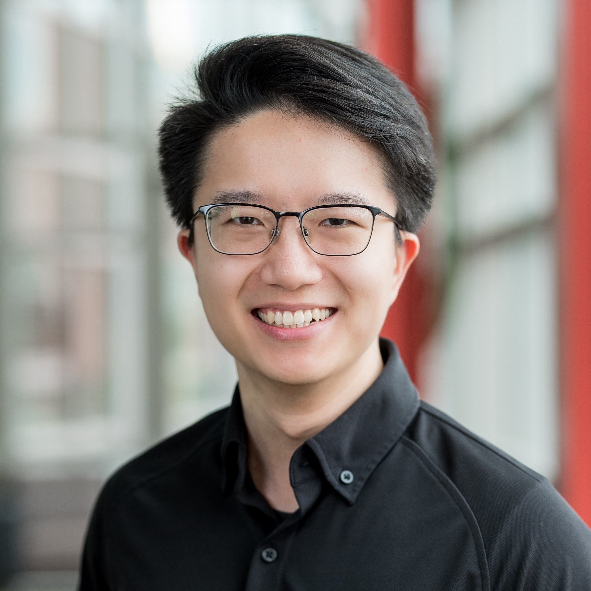
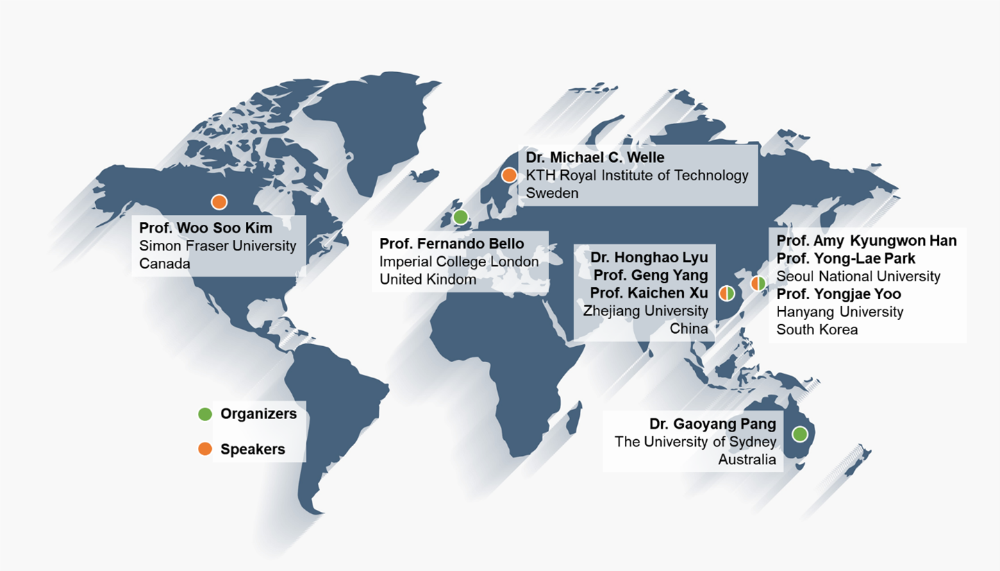
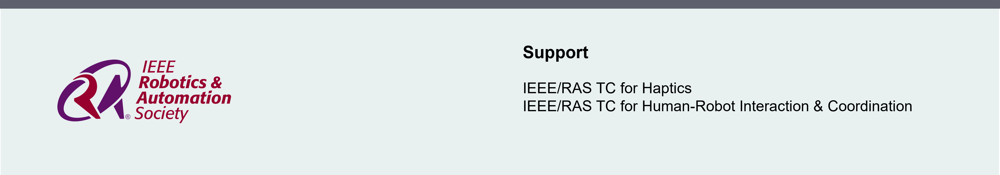

<html lang="zh">
<head>
  <meta charset="UTF-8">
  <title>IROS2025 Workshop</title>
  
</head>
<body>

<h1>IROS2025 Workshop</h1>
<h2>Advanced Haptic Sensors and Devices for Healthcare Robots</h2>

Tips: You can get a better experience of this site in <a href="https://www.google.com/chrome">Google chrome</a> browser.

<h3>Abstract and Website</h3>

Advanced haptic technologies in healthcare robotics are redefining medical practices, enhancing the precision of nursing tasks, improving rehabilitation processes, and elevating patient care experiences. This workshop explores the cutting-edge advancements, challenges, and future directions in haptic-enabled robotics for healthcare applications. It aims to evaluate the role of haptic technologies in revolutionizing tactile feedback, skill transfer, and human-robot interaction within clinical and caregiving environments. The workshop will delve into multidisciplinary discussions on the transformative potential of haptic technologies in healthcare, showcasing innovations such as haptic devices for medical diagnosis, robotic systems for physical rehabilitation, tactile training platforms for caregiver skill acquisition, and haptic-enabled robots providing nuanced sensory feedback for improved healthcare outcomes. Key themes include the development and integration of advanced haptic devices, wearable haptic interfaces, sensor fusion technologies, real-time haptic feedback systems, and their application to critical healthcare scenarios. We will emphasize the importance of human-centered design, user studies, and evaluations to ensure seamless adoption in robotic nursing care environments. Moreover, the workshop will address ethical considerations, regulatory challenges, and technical barriers while highlighting opportunities for collaboration between academia, healthcare professionals, and industry stakeholders. By featuring expert presentations, interactive panel discussions, live demonstrations, and networking sessions, the workshop seeks to catalyze innovation and chart a roadmap for the future of haptic technologies in healthcare robotics.

<b>Workshop Website: </b><a href="https://fsie-robotics.com/IROS2025-Workshop-AHFHR">https://fsie-robotics.com/IROS2025-Workshop-AHFHR</a>

<h3>Organizers</h3>
<table border="0" style="width: 90%; table-layout: fixed;">
  <tr>
    <td style="width: 15%; text-align: center; padding: 5px;">
      

        
      

    </td>
    <td style="width: 15%; text-align: center; padding: 5px;">
      

        
      

    </td>
    <td style="width: 15%; text-align: center; padding: 5px;">
      

        
      

    </td>
    <td style="width: 15%; text-align: center; padding: 5px;">
      

        
      

    </td>
    <td style="width: 15%; text-align: center; padding: 5px;">
      

        
      

    </td>
    <td style="width: 15%; text-align: center; padding: 5px;">
      

        
      

    </td>
  </tr>
  <!-- 第二行：文本 -->
  <tr>
    <td style="text-align: center; padding: 5px; font-size: 14px; vertical-align: top;">
      

        <a href="https://fsie-robotics.com" target="_blank" rel="noopener">Honghao Lyu</a> 
        Zhejiang University 
        lvhonghao@zju.edu.cn
      

    </td>
    <td style="text-align: center; padding: 5px; font-size: 14px; vertical-align: top;">
      

        <a href="https://hero.snu.ac.kr" target="_blank" rel="noopener">Amy Kyungwon Han</a> 
        Seoul National University 
        amyhan@snu.ac.kr
      

    </td>
    <td style="text-align: center; padding: 5px; font-size: 14px; vertical-align: top;">
      

        <a href="https://profiles.imperial.ac.uk/f.bello" target="_blank" rel="noopener">Fernando Bello</a> 
        Imperial College London 
        f.bello@imperial.ac.uk
      

    </td>
    <td style="text-align: center; padding: 5px; font-size: 14px; vertical-align: top;">
      

        <a href="https://sites.google.com/view/gaoyang" target="_blank" rel="noopener">Gaoyang Pang</a> 
        Sydney University 
        gaoyang.pang@sydney.edu.au
      

    </td>
    <td style="text-align: center; padding: 5px; font-size: 14px; vertical-align: top;">
      

        <a href="https://softrobotics.snu.ac.kr/people.php" target="_blank" rel="noopener">Yong-Lae Park</a> 
        Seoul National University 
        ylpark@snu.ac.kr
      

    </td>
    <td style="text-align: center; padding: 5px; font-size: 14px; vertical-align: top;">
      

        <a href="http://www.fsie-zju.com/" target="_blank" rel="noopener">Geng Yang</a> 
        Zhejiang University 
        yanggeng@zju.edu.cn
      

    </td>
  </tr>
</table>

<h3>Content of the workshop and expected impact</h3>

<h4>Objectives of the Workshop</h4>

The objective of this workshop is to explore and promote the integration of advanced haptic technologies in healthcare robotics, focusing on enhancing rehabilitation, assistive devices, and patient care. The workshop aims to showcase cutting-edge innovations in haptic feedback systems, emphasizing their applications in robotic rehabilitation platforms and assistive solutions for individuals with disabilities or mobility challenges. By fostering cross-disciplinary collaboration between robotics researchers, healthcare professionals, and engineers, the event will address key challenges in the design and implementation of haptic systems, such as real-time feedback, sensor accuracy, and user-centered development. It will also examine the ethical, regulatory, and societal implications of deploying haptic-enabled healthcare robots, discussing issues like privacy, autonomy, and equity. Lastly, the workshop will provide a platform for future research and innovation, advancing the role of haptic technologies in healthcare and catalyzing growth in this field.

<h3>Invited speakers</h3>
<table border="0" style="width: 100%; table-layout: fixed;">
  <tr>
    <td style="width: 14%; text-align: center; padding: 5px;">
      

        
      

    </td>
    <td style="width: 14%; text-align: center; padding: 5px;">
      

        
      

    </td>
    <td style="width: 14%; text-align: center; padding: 5px;">
      

        
      

    </td>
    <td style="width: 14%; text-align: center; padding: 5px;">
      

        
      

    </td>
    <td style="width: 14%; text-align: center; padding: 5px;">
      

        
      

    </td>
    <td style="width: 14%; text-align: center; padding: 5px;">
      

        
      

    </td>
    <td style="width: 15%; text-align: center; padding: 5px;">
      

        
      

    </td>
  </tr>
  <!-- 第二行：文本 -->
  <tr>
    <td style="text-align: center; padding: 5px; font-size: 14px; vertical-align: top;">
      

        <a href="https://www.sfu.ca/additive-manufacturing-lab.html" target="_blank" rel="noopener">Prof. Woo Soo Kim</a> 
        Simon Fraser University 
        woosook@sfu.ca
      

    </td>
    <td style="text-align: center; padding: 5px; font-size: 14px; vertical-align: top;">
      

        <a href="https://people.kth.se/~mwelle/" target="_blank" rel="noopener">Dr. Michael C. Welle</a> 
        KTH royal institute of technology 
        mwelle@kth.se
      

    </td>
    <td style="text-align: center; padding: 5px; font-size: 14px; vertical-align: top;">
      

        <a href="https://blog.nus.edu.sg/xukaichen/" target="_blank" rel="noopener">Prof. Kaichen Xu</a> 
        Zhejiang University 
        xukc@zju.edu.cn
      

    </td>
    <td style="text-align: center; padding: 5px; font-size: 14px; vertical-align: top;">
      

        <a href="https://milab.hanyang.ac.kr/home" target="_blank" rel="noopener">Prof. Yongjae Yoo</a> 
        Hanyang University 
        yongjaeyoo@hanyang.ac.kr
      

    </td>
    <td style="text-align: center; padding: 5px; font-size: 14px;     vertical-align: top;">
      

        <a href="https://ese.xmu.edu.cn/info/1072/6024.htm" target="_blank" rel="noopener">Prof. Xinqin Liao</a> 
         Xiamen University 
        liaoxinqin@ xmu.edu.cn
      

    </td>
    <td style="text-align: center; padding: 5px; font-size: 14px;     vertical-align: top;">
      

        <a href="https://www.engineering.columbia.edu/faculty-staff/directory/yunzhu-li" target="_blank" rel="noopener">Prof. Yunzhu Li</a> 
         Columbia University 
        yunzhu.li@ columbia.edu
      

    </td>
    <td style="text-align: center; padding: 5px; font-size: 14px; vertical-align: top;">
      

        <a href="http://www.fsie-zju.com/" target="_blank" rel="noopener">Prof. Geng Yang</a> 
        Zhejiang University 
        yanggeng@zju.edu.cn
      

    </td>
  </tr>
</table>

<h3>Structure of the workshop</h3>

The workshop will be structured to encourage open-ended discussions and active participation, especially between established experts and early-career researchers. The structure includes:

<b>1) Invited Talks:</b> Potential five invited speakers will deliver in-depth presentations on key topics related to haptic technologies for healthcare robotics, setting the stage for broader discussions.

<b>2) Participant Presentations:</b> Other participants will showcase their research through presentations, fostering engagement and enabling participants to exchange ideas directly with the speakers and the audience.

<b>3) Poster Session:</b> A dedicated time for early-career researchers, including students and postdoctoral researchers, to present their work, offering an interactive environment for detailed discussions with attendees and experts.

<b>4) Interactive Session:</b> This session will facilitate group discussions and brainstorming on the challenges and future directions in the field, encouraging participation from all attendees. The organizers will prepare several questions on key challenges in the field to facilitate discussion.

We will fully utilize the platform and network of the mentioned three IEEE RAS TCs and the IEEE IES TC-II, ensuring participation from a diverse and engaged audience across the various subfields of robotics and healthcare. The TC platform will facilitate cross-disciplinary interaction and increase visibility for the workshop, promoting continued collaboration beyond the event.

<h3>Call for Papers</h3>
<h4 style="line-height: 0.2;">Content</h4>
<ul>
  <li> We invite extended abstract for interactive poster presentations at the IROS  2025 Workshop on Advanced Haptic Sensors and Devices for Healthcare Robots, with a minimum length of  2 pages.</li>
  <li>The extended abstract must be formatted using the standard <a href="https://www.ieee.org/conferences/publishing/templates"> IEEE conference template </a>.</li>
  <li><u>Authors are allowed to use material that has already been publicly published.</u></li>
</ul>

<h4 style="line-height: 0.2;">Submission Instructions</h4>
<ul>
  <li>
    The extended abstract and the video should be submitted as both attachments and downloadable/streamable links via email to the designated address:
    <a href="mailto:iros2025-hatpic@outlook.com">iros2025-hatpic@outlook.com</a>.
  </li>
  <li> Please include the author’s name and the phrase “IROS2025 Workshop-Haptics” in the email subject line.</li>
  <li> Please provide a clear and concise description of the attached files in the body of the email.</li>
</ul>
<h4 style="line-height: 0.2;">Review and Acceptance</h4>
<ul>
  <li> The submitted extended abstracts will be reviewed by the organizing committee.</li>
  <li> Accepted extended abstracts will be invited for <strong> poster presentations </strong> during the workshop. Outstanding candidates will be selected to give <strong>oral presentations</strong>.</li>
  <li>This workshop will give awards for “Best Paper” and honorable mentions, as well as “Best Poster” and honorable mentions. Award-winning authors will receive certificates, monetary prizes, or other gifts.</li>
</ul>
<h4 style="line-height: 0.2;">Important Dates</h4>
<ul>
  <li> <strong>Submission Deadline:</strong>  31 Augest 2025  </li>
  <li> <strong>Notification of Acceptance:</strong>  5 September 2025  </li>
</ul>

<h3>Venue:</h3>
<li>  20 October, 2025  (Morning)</li>
<li>  Room 101, Hangzhou International Expo Center, Hangzhou, China</li>

<h3>Tentative Schedule:</h3>
<table>
  <tr>
    <th class="time-column">Time</th>
    <th class="talk-column">Talk</th>
    <th class="comments-column">Comments</th>
  </tr>
  <tr>
    <td class="time-column">8:00–8:50</td>
    <td class="talk-column">Registration</td>
    <td class="comments-column">Host: Dr. Honghao Lyu</td>
  </tr>
  <tr>
    <td class="time-column">8:50–9:00</td>
    <td class="talk-column">Welcome and Introduction</td>
    <td class="comments-column">Host: Prof. Amy Kyungwon Han</td>
  </tr>
  <tr>
    <td class="time-column">9:00–9:20</td>
    <td class="talk-column">Prof. Woo Soo Kim: New Frontiers in 3D Structural Sensing for Healthcare Applications (tentative)</td>
    <td class="comments-column">Host: Dr. Honghao Lyu & Prof. Geng Yang</td>
  </tr>
  <tr>
    <td class="time-column">9:20–9:40</td>
    <td class="talk-column">Dr. Michael C. Welle: Enabling Robot Manipulation of Soft and Rigid Objects with Vision-based Tactile Sensors (tentative)</td>
    <td class="comments-column">Host: Dr. Honghao Lyu & Prof. Geng Yang</td>
  </tr>
  <tr>
    <td class="time-column">9:40–10:20</td>
    <td class="talk-column">Lightning Talks</td>
    <td class="comments-column">Order Maintenance: Dr. Gaoyang Pang</td>
  </tr>
  <tr>
    <td class="time-column" style="background-color: #f7f7f7;">10:20–10:40</td>
    <td class="time-column" style="background-color: #f7f7f7;">Coffee Break & Poster Session</td>
    <td class="time-column" style="background-color: #f7f7f7;">Let’s chat and relax</td>
  </tr>
  <tr>
    <td class="time-column">10:40–11:00</td>
    <td class="talk-column">Prof. Kaichen Xu: Multifunctional Flexible Sensors for Healthcare Robots (tentative)</td>
    <td class="comments-column">Host: Dr. Gaoyang Pang & Prof. Yong-Lae Park</td>
  </tr>
  <tr>
    <td class="time-column">11:00–11:20</td>
    <td class="talk-column">Prof. Yongjae Yoo: Dual-Frequency Superimposed Vibration for Robot Haptic Ability (tentative)</td>
    <td class="comments-column">Host: Dr. Gaoyang Pang & Prof. Yong-Lae Park</td>
  </tr>
  <tr>
    <td class="time-column">11:20–11:40</td>
    <td class="talk-column">Prof. Geng Yang: A Deep Learning-Enhanced Super-Resolution Tactile Sensor (tentative)</td>
    <td class="comments-column">Should any additional speaker invitations be confirmed, the agenda will be updated accordingly.</td>
  </tr>
  <tr>
    <td class="time-column">11:40–12:10</td>
    <td class="talk-column">Interactive Session</td>
    <td class="comments-column">Host: Prof. Amy Kyungwon Han</td>
  </tr>
  <tr>
    <td class="time-column">12:10–12:30</td>
    <td class="talk-column">Plenary, TC Action Planning and Wrap-Up</td>
    <td class="comments-column">Host: Prof. Amy Kyungwon Han</td>
  </tr>
</table>
<b>Note: </b>If additional speaker invitations are confirmed, the agenda will be updated accordingly.

 
 

 
 

</body>
</html>
